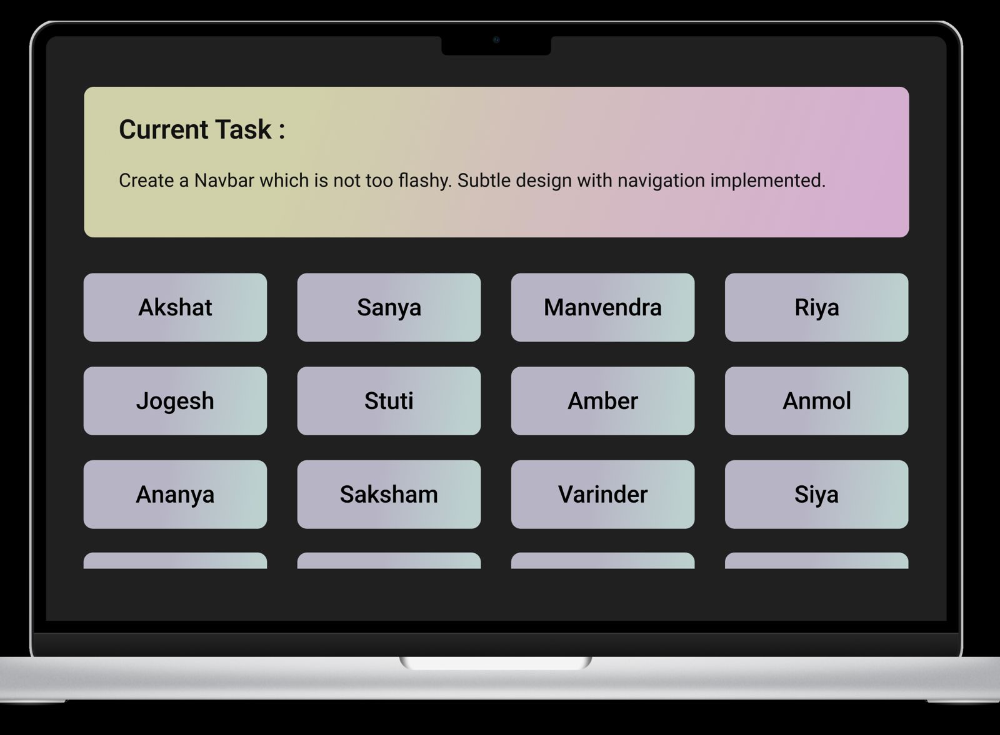

# WebDev-Tasks

Frontend development is all about practicing and learning the different frameworks, libraries and systems. This web-app is aimed at frontend developers who wish to improve their skills by practicing coding UI elements like buttons, forms, etc., and figuring out the different ways these elements can be created by using various libraries and frameworks.  We wish to motivate beginners to explore the field of web development by actually doing and searching the methods of coding a website.

This project is built using the MERN stack. 

## How to Use  

 

 

1. The top “Current Task” bar would be controlled by the backend, new tasks will be pushed regularly for the developers to practice.
2. Interested developers can practice their skills by participating in the task. Eg: first task is to make their own button on the front page wich will redirect to /dashboard/student_name.

<h3>* This is a rough user flow upon which the project will be built. The feature-set and the code are subject to changes *</h3> 

# How to Contribute

We follow a systematic Git Workflow -

- Create a fork of this repo.
- Clone your fork of your repo on your pc.
- [Add Upstream to your clone](https://help.github.com/en/github/collaborating-with-issues-and-pull-requests/configuring-a-remote-for-a-fork)
- **Every change** that you do, it has to be on a branch. Commits on master would directly be closed.
- Make sure that before you create a new branch for new changes, [syncing with upstream](https://help.github.com/en/github/collaborating-with-issues-and-pull-requests/syncing-a-fork) is necessary.
 

<h3 color="grey"> 

Make sure you read the [CONTRIBUTIONS](./CONTRIBUTIONS.md) before you start contributing such that you make remarkable and easily acceptable PRs.</h3>
 

# OWASP Student Chapter, TIET

   

<h3 align="center">Thapar Institute of Engineering and Technology (TIET) has been a steady source of highly skilled talent to the nation as well as overseas. A pioneer in engineering education, research and innovation. The team of OWASP Student Chapter, one of the gilt-edged coding society, involves ingenious mind solvers who are eager to make the world a better place to live in with their innovative techniques and discoveries. By successfully organising many hackathons, tech-talks, workshops and coding nights, we have always strived hard to maintain the coding culture throughout the campus.</h3> 

Check out our work at [owasp.co.in](http://owasp.co.in) 

## Contact Us

<h3>

[Instagram](https://www.instagram.com/owasp_tiet/)
</h3>

<h3>

[Github](https://github.com/OWASP-STUDENT-CHAPTER)
</h3>

<h3>

[Twitter](https://twitter.com/Owasp_tiet)
</h3>

<h3>

[Linkedin](https://www.linkedin.com/company/owasp-tiet/)
</h3>

